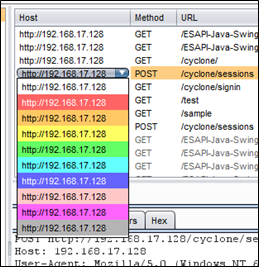
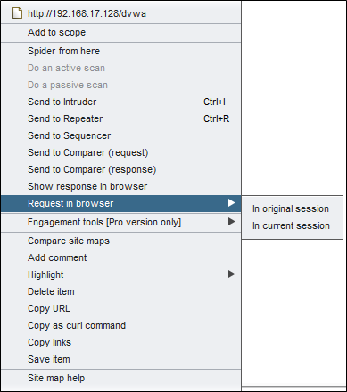
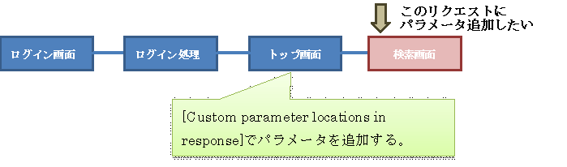
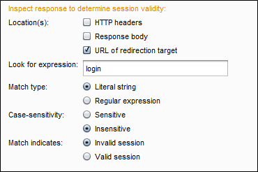
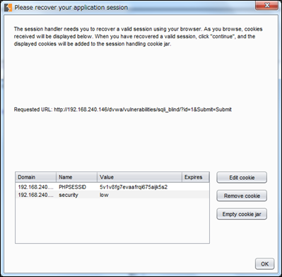
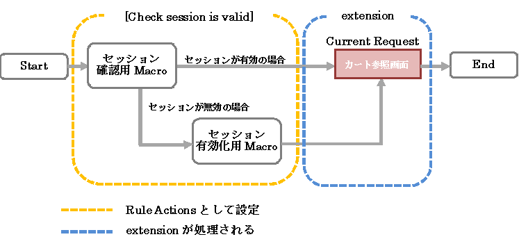
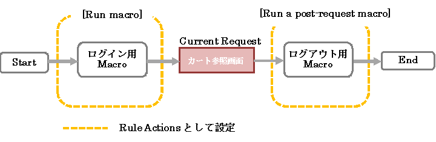

1. 1.はじめに

Burp SuiteはPortSwigger 社が作成したJava製のローカルProxyソフトです。ローカルProxyとは、会社や学校などで使用されているProxyとは異なり、Webアプリケーションのセキュリティ診断やデバックなどに活用されます。Burp SuiteはWebアプリケーションのセキュリティ診断に特化したツールで、Burp Suite以外にもOWASP ZAPやFiddlerなどが存在しています。

Burp Suite　 [http://portswigger.net/](http://portswigger.net/)

ローカルProxyは、利用者とWebサイトの中間にはいり、HTTPやHTTPSのリクエス・レスポンスの内容を変更することが可能です。Webアプリケーションへのセキュリティ診断の場合、リクエストにXSSやSQLインジェクションが発現するような内容に変更し、レスポンス結果で脆弱性の有無を判定します。

Burp Suiteは、有償版（Professional Edition）と無償版（Free Edition）の2つ存在しています。無償版はメジャーバージョンのみとなっており、2015年2月14日現在version1.6です。有償版はマイナーバージョンを含むものも利用可能で、version1.6.10です。有償版は、1ユーザ年間299ドル（2015年2月14日時点）となっています。

| バージョン | リリース日 |
| --- | --- |
| 1.1 | 2007年12月9日 |
| 1.2 | 2008年12月14日 |
| 1.3 | 2010年1月7日 |
| 1.4 | 2011年6月3日 |
| 1.5 | 2012年10月31日 |
| 1.6 | 2014年4月15日 |

無償版は、有償版と比較するといくつかの機能が無効化されていますが、診断を行うことは可能です。無償版では、[Scanner]やタイムスケジュールが利用できなかったり、ログの出力などに制限があります。本ドキュメントは無償版(version 1.6）で利用可能な機能について記載します。

本ドキュメントに記載されている内容は、誤って操作した場合などに不正アクセスとして誤解を招く可能性があるため、自分の管理下の環境や管理者から許可を取得した環境に対してのみ実施してください。また、本ドキュメントは、マニュアルや検証結果を記載しておりBurp Suiteの動作などを保障するものではありません。

1. 2.インストール方法および実行方法

最新バージョンのBurp Suiteをダウンロードページ(http://portswigger.net/burp/download.html) よりダウンロードします。ファイルは実行可能なJARファイルなので、Javaが実行可能なWindows環境ではダブルクリックするだけで、Burp Suiteは実行されます。または、コマンドラインで「java -jar -Xmx1024m /path/to/burp.jar」で実行することも可能です。ただし、Javaのバージョンは1.6以降である必要があります。

1. 3.ブラウザの設定

初期設定では、「127.0.0.1:8080」で待ち受けをしています。そのため、利用するブラウザでProxy設定を「127.0.0.1:8080」にする必要があります。

**まだ途中。**

1. 4.機能について

Burp Suiteは、「Recon and Analysis」、「Vulnerability Detection and Exploitation」、「Tool Configuration」の3つのworkflowから構成されています。「Recon and Analysis」は、Webアプリケーションの調査や分析するための機能群で、Proxyや自動的な探索を行うSpiderなどが含まれます。「Vulnerability Detection and Exploitation」は調査や分析後、脆弱性の調査するための機能群で、ScannerやIntruderなどが含まれます。「Tool Configuration」はアプリケーションの動作確認など、脆弱性の調査に必要となる機能群で、す。

Burp Suiteの機能は以下となっています。Scannerは有償版のみ利用することができる機能ですが、各機能でも一部の設定が有償版のみとなっているものもあります。

| 機能 | 概要 |
| --- | --- |
| Target | アクセスしたサイトの詳細を確認することができます。 |
| Proxy | すべてのリクエストおよびレスポンスの参照や編集することができます。 |
| Spider | 自動的なクローリングすることができます。 |
| Scanner（有償版のみ） | 診断を行い、自動的に脆弱性を検出することができます。 |
| Intruder | カスタマイズしたパターンでの診断をすることができます。Scannerと違い、自動で脆弱性を検出することはできません。 |
| Repeater | HTTPリクエストを手動で修正し、再送付することができます。 |
| Sequencer | セッションIDなどを複数収集し、ランダム性などの解析に利用することができます。 |
| Decoder | 指定する文字列のBASE64やURLエンコード・デコードなどの変換をすることができます。 |
| Comparer | 2つのログのdiffをとることができます。 |
| Extender | サードパーティのコードを用いて機能追加をすることができます。 |
| Options | オプションを設定することができます。 |
| Alerts | エラー等を確認することができます。 |
| メニューバー | ログの保存などができます。 |

表 2

1. 5.[Target]について

[Target]でアクセスしたサイトの詳細情報を確認することができ、[Site map]、[Scope]から構成されています。

[Site map]は、アクセスしたリクエスト・レスポンスおよびそのレスポンス中に含まれるリンクなどをツリー状に表示します。アクセスしたHTTPログは黒字で表示され、未アクセスであるHTTPログはグレーで表示されます。httpsのサイトの場合、鍵マークが表示さます。

表示されるカラムを3に記載します。

| カラム名 | 概要 |
| --- | --- |
| Host | プロトコル（httpまたはhttps）および接続するホストが表示される。 |
| Methond | メソッド（POSTかGET）が表示される。 |
| URL | パスおよびクエリーストリングが表示される。 |
| Params | GETまたはPOSTパラメータが存在している場合、チェックされる。 |
| Status | レスポンスコードが表示される。 |
| Length | 改行コードも含むレスポンスの総byte数が表示される。※Content-Lengthの値ではありません。 |
| MIME type | Burp Suite上のMIMEタイプが表示される。 |
| Title | Titleタグの内容が表示される。 |
| Comment | 記載したコメントが表示される。HTTPログのComment箇所をダブルクリックするとコメントの入力が可能です。 |
| Time requested | リクエストの発行した時刻が表示される。 |

表 3

[Target]だとOPTIONS、TRACEなどのメソッドはGETとして表示されます。これは、Burp Suiteのバグで、有償版v1.6.12で修正されているようです（ **未確認です** ）。

「Host」箇所を押下するとカラーパターンが表示されます。任意のカラーを選択すると該当のHTTPログが色づけされます。重要なHTTPログや気になるログがあれば、色づけすると後で見直す手間が省けます。また、[Add Comment]などのコメント機能を併用することでより効果が高まります。

HTTPログを選択して、右クリックするとサブメニュが表示されます。各サブメニュを4に記載します。

| サブメニュ | 概要 |
| --- | --- |
| Add to scope | 選択したHTTPリクエストのURLおよび配下のすべてを[scope]-[Include in scope]に追加する。 |
| Remove from scope | 選択したHTTPリクエストのURLおよび配下のすべてを[scope]-[Exclude from scope]に追加する。 |
| Spider from here | 選択したHTTPリクエストを起点に[Spider]を実施する。 |
| Do an active scan | 有償版で実施可能。 |
| Do a passive scan | 有償版で実施可能。 |
| Send to Intruder | 選択したHTTPリクエストを[Intruder]にセットする。 |
| Send to Repeater | 選択したHTTPリクエストを[Repeater]にセットする。 |
| Send to Sequencer | 選択したHTTPリクエストを[Sequencer]にセットする。 |
| Send to Comparer(request) | 選択したHTTPリクエストを[Comparer]にセットする。 |
| Send to Comparer(response) | 選択したHTTPレスポンスを[Comparer]にセットする。 |
| Show response in browser | 選択したHTTPレスポンスをブラウザで表示する。 |
| Request in browser | 選択したHTTPリクエストをブラウザから送付させる。 |
| Engagement tools[Pro version only] | 有償版で実施可能。コメントや参照元の検索など複数の機能を提供。 |
| Compare site maps | 2つのSite mapの比較を行う。 |
| Add comment | 選択したHTTPログにコメントを記載する。 |
| Highlight | 選択したHTTPログを指定するカラーパターンで表示する。 |
| Delete item | 選択したHTTPログを削除する。 |
| Copy URL | 選択したHTTPリクエストのURLをコピーします。 |
| Copy as curl command | 選択したHTTPリクエストをcurlコマンドの実行形式としてコピーします。 |
| Copy links | 選択したHTTPレスポンスのリンクをコピーします。 |
| Save item | 選択したHTTPログをXML形式で保存します。 |

表 4

[Add to scope]、[Remove from scope]、[Spider from here]の詳細は後述します。[Do an active scan]、[Do a passive scan]は、詳細を割愛します。

**Compare Site mapについてまだ**

[Show response in browser]は、後述する条件を除けばサーバにリクエストを送付せずに選択したHTTPレスポンスをブラウザ上に表示することが可能です。対象のHTTPログの画面構成などを再度確認する際に役立ちます。実行すると9のダイアログが出力されるので、[Copy]を押下し、Burp Suiteをプロキシとして設定しているブラウザであればレスポンスを参照できます。

この機能で注意が必要な点として、選択したHTTPレスポンスでJSやCSSなどの外部コンテンツを必要とし、その外部コンテンツがブラウザのキャッシュに存在しない場合、サーバにリクエストが送付されます。Burp SuiteではInterceptできないため、一切のリクエストを送付しないようにするには上位のProxyなどで別途制御する必要があります。

[Request in browser]は、Interceptすることで選択したHTTPリクエストを再編集し、そのレスポンスをブラウザで表示させることが可能です。サブメニュとして[In original session]と[In current browser session]のどちらかを選択する必要があります。[In original session]は、選択したHTTPリクエストに設定されているCookieでアクセスを試行します。[In current browser session]は、ブラウザで有するCookieでアクセスを試行します。

[Add comment]は、該当のHTTPログにコメントを記載することが可能です（11）。また、12のように[Comment]箇所をダブルクリックしてコメントを記載することも可能です。

HTTPのレスポンスに存在するタグなどから、リンクされているサイトを自動的に認識して一覧表示します。タグごとで自動認識されるか確認した結果を3に記載します。一部△になっているものは、[Filter]-[Filter by MIME type]で有効（チェックを入れる）にした場合、一覧に表示されます。存在しないようなタグや属性も認識することは可能ですが、属性名が指定されていない場合は認識していません。

| レスポンス中の文字列 | 認識状況 |
| --- | --- |
| &lt;video src="http://sample.co.jp"&gt;sample&lt;/video&gt; | △（Other binaryを有効） |
| &lt;a href="http://sample.co.jp"&gt;sample&lt;/a&gt; | ○ |
| &lt;script src="http://sample.co.jp"&gt;&lt;/script&gt; | ○ |
| &lt;img src="http://sample.co.jp"&gt;sample&lt;/img&gt; | △（Imagesを有効） |
| &lt;applet code="http://sample.co.jp" width="1" height="1"&gt;&lt;/applet&gt; | △（Other binaryを有効） |
| &lt;frameset cols="\*"&gt;&lt;frame src="http://sample.co.jp" name="a"&gt;&lt;/frameset&gt; | ○ |
| &lt;form action="http://sample.co.jp" method="post&gt;&lt;input type="hidden" name="p" value="1"&gt;&lt;/form&gt; | ○ |
| &lt;form action="http://sample.co.jp?p=1" method="get&gt;&lt;/form&gt; | ○ |
| &lt;iframe src="http://sample.co.jp"&gt;&lt;/iframe&gt; | ○ |
| &lt;object data="http://sample.co.jp" type="image/gif"&gt;&lt;/object&gt; | △（Other binaryを有効） |
| &lt;embed src="http://sample.co.jp" width="128" height="128"&gt;&lt;/embed&gt; | △（Other binaryを有効） |
| &lt;audio src="http://sample.co.jp"&gt;&lt;/audio&gt; | △（Other binaryを有効） |
| &lt;source src='http://sample.co.jp' type='video/ogg; codecs="theora, vorbis"'&gt;&lt;/source&gt; | ○ |
| &lt;map name="map"&gt;&lt;area shape=rect coords="50,50,100,100" href="http://sample.co.jp"&gt;&lt;/map&gt; | ○ |
| &lt;link rel="stylesheet" type="text/css" href="http://sample.co.jp" media="all"&gt; | △（CSSを有効） |
| &lt;xxx src="http://sample.com"&gt;xxx&lt;/xxx&gt; | ○ |
| &lt;xxx xxx="http://sample.com"&gt; | ○ |
| &lt;xxx xxx='http://sample.com'&gt; | ○ |
| &lt;xxx xxx=http://sample.com&gt; | ○ |
| &lt;xxx "http://sample.com"&gt; | × |
| &lt;xxx http://sample.com&gt; | × |
| &lt;http://sample.com&gt; | × |
| &lt;xxx&gt;http://sample.com&lt;/xxx&gt; | ○ |
| &lt;xxx&gt;//sample.com&lt;/xxx&gt; | × |
| &lt;xxx&gt;sample.com&lt;/xxx&gt; | × |
表 5

[Filter by MIME type]でどのように分類されるのか検証した結果を4に記載します。拡張子ごとにMIME typeが定義されており、存在しない拡張子の場合にタグに対して定義しているMIME typeが選択されていると推測されます。

| レスポンス中の文字列 |   |
| --- | --- |
| &lt;a href="http://sample.jp/a.jpg"&gt;sample&lt;/a&gt; | Image |
| &lt;a href="http://sample.jp/a.bmp"&gt;sample&lt;/a&gt; |
| &lt;a href="http://sample.jp/a.gif"&gt;sample&lt;/a&gt; |
| &lt;a href="http://sample.jp/a.png"&gt;sample&lt;/a&gt; |
| &lt;script src="http://sample.jp/a.jpg"&gt;&lt;/script&gt; |
| &lt;a href="http://sample.jp/a.doc"&gt;sample&lt;/a&gt; | HTML |
| &lt;a href="http://sample.jp/a.xls"&gt;sample&lt;/a&gt; |
| &lt;a href="http://sample.jp/a.pdf"&gt;sample&lt;/a&gt; |
| &lt;a href="http://sample.jp/a"&gt;sample&lt;/a&gt; |
| &lt;a href="http://sample.jp/a.zip"&gt;sample&lt;/a&gt; |
| &lt;a href="http://sample.jp/a.tar.gz"&gt;sample&lt;/a&gt; |
| &lt;a href="http://sample.jp/a.7z"&gt;sample&lt;/a&gt; |
| &lt;a href="http://sample.jp/a.flv"&gt;sample&lt;/a&gt; |
| &lt;a href="http://sample.jp/a.asp"&gt;sample&lt;/a&gt; |
| &lt;a href="http://sample.jp/a.jsp"&gt;sample&lt;/a&gt; |
| &lt;a href="http://sample.jp/a.php"&gt;sample&lt;/a&gt; |
| &lt;a href="http://sample.jp/a.xxx"&gt;sample&lt;/a&gt; |
| &lt;script src="http://sample.jp/a.html"&gt;&lt;/script&gt; |
| &lt;a href="http://sample.jp/a.css"&gt;sample&lt;/a&gt; | CSS |
| &lt;script src="http://sample.jp/a.css"&gt;&lt;/script&gt; |
| &lt;a href="http://sample.jp/a.js"&gt;sample&lt;/a&gt; | Script |
| &lt;script src="http://sample.jp/a.jar"&gt;&lt;/script&gt; |
| &lt;script src="http://sample.jp/a.xxx"&gt;&lt;/script&gt; |
表 6

1. 6.ブラウザの設定

1. 7.セッション管理などの補助機能

**Current Requestについて**

Burp Suiteには、セッション管理などを補助するための機能がいくつか用意されています。

1.
  - ・・Macro
  - ・・Cookie jar
  - ・・Session Handling Rules

Macroは1つまたは複数のリクエストをBurp Suiteに送信させるための仕組みです。ログインやショッピングサイトでの商品の購入処理などの複数のリクエストをMacroとして登録することで、同様のリクエストを送信させ、ログインの試行や商品の購入処理を再現することが可能です。

Cookie jarはMacroなどを利用して取得されたCookieをドメインおよびCoookie名で管理します。取得されたCookieは、同一ドメインに対するリクエストへ自動的にセットされ、送信されます。Cookie jarで管理するCookieはSet-Cookieのタイミングで更新されます。

Session Handling RulesはMacroやCookie jarを制御するための仕組みです。Macroの実行やCookie jarの更新範囲を指定して、セッションが無効となった場合に、ログインを試行することなど、条件に合わせたリクエストの送信が可能となります。

1. 8.Macro

[Options]-[Session]-[Macro]でMacroの登録できます。Macroは1つまたは複数のリクエストを1つのセットとして登録して、登録されたリクエストを再送することができます。ログインなどの処理を再現させることができます。

[Macro Editor]では、Macroとして登録するリクエストに対してパラメータの追加や削除などの編集が可能です。下側のペインで直接リクエストを編集できます。ただ、パラメータの追加や削除を行った場合は、[Macro Editor]に再認識させるために[Re-analyze macro]を実行する必要があります。

HTTPログを選択し、[Configure item]を押下すると該当リクエストのパラメータやCookieの設定できます。[Re-record macro]は、[Macro Recorder]が表示されて再度対象となるHTTPログの再選択が可能となります。[Re-analyze macro]を実行すると、Macroにパラメータの追加・削除・変更が反映されます。

[Configure Macro Item]は、[Cookie handling]、[Parameter handling]、[Custom parameter locations in response]の3つのパートから構成されています。

[Cookie handling]では、Cookie jarの処理を指定することができます。[Add cookies received in responses to the handling cookie jar]をチェックしている場合、レスポンスでSet-Cookieされた場合にCookie jarへ登録されます。既に登録済みのCookieが存在している場合は、値が更新されます。[Use cookies from the session handling cookie jar in requests]をチェックしている場合、Cookie jarに登録されているCookieがリクエストに反映されます。

|   | [Add cookies received …]を有効 | [Add cookies received …]を無効 |
| --- | --- | --- |
| [Use cookies from…]を有効 | Cookie jarのCookieをリクエストに反映し、レスポンスでSet-Cookieされた場合はCookie jarに反映させる。 | Cookie jarのCookieをリクエストに反映する（レスポンスにSet-CookieがあってもCookie jarは更新しない）。 |
| [Use cookies from…]を無効 | Cookie jarのCookieをリクエストに反映せず（Macro Editor選択時のCookieでリクエストする）、レスポンスでSet-Cookieされた場合はCookie jarに反映させる。 | Macro Editor選択時のCookieでリクエストする（レスポンスにSet-CookieがあってもCookie jarは更新しない）。 |

表 7

[Parameter handling]はリクエストに存在するGETおよびPOSTパラメータが一覧表示されます。[Use present value]は固定値として設定します。[Drive from prior response]はレスポンスから値を設定することが可能で、ワンタイムトークンなど値が可変であるパラメータに有効です。

[Parameter handling]は、GETパラメータなのかPOSTパラメータなのか画面上では判断がつかず、同じ名前のパラメータが存在していた場合はパラメータの値で区別する必要があります。設定内容を確認は、[Test macro]を実施しリクエスト中の値を確認する必要があります。

[Custom parameter locations in response]で追加したいパラメータの設定ができます。

検索画面のリクエストにパラメータを追加する場合、トップ画面でパラメータ名や値を指定します。トップ画面で指定するパラメータ名と検索画面でリクエストに追加するパラメータ名は一致する必要があります。一致しない場合、値の設定は行われません。

9の検索画面へのリクエストにGETパラメータ「addition\_param」というパラメータを追加し、値はトップ画面のtitleタグ内の文字列をセットする場合の手順は、大きく2つあります。

1. 1 **追加したリクエストにパラメータを認識させる。**
2. 2 **追加するパラメータの値を取得する。**

1. 1 **追加したリクエストにパラメータを認識させる。**

[Macro editor]で9の検索画面のHTTPログを選択し、[Request]タブから直接リクエストを修正します。検索画面にはGETパラメータが存在していないため、URL「http://192.168.240.146/dvwa/vulnerabilities/sqli\_blind/」の末尾に「?addition\_parame=」を追加します。

[Re-analyze macro]を実行し、追加したパラメータをBurp Suiteに認識させます。

検索画面のHTTPログを選択し、[Configure item]を実行するとパラメータ「addition\_parame」が追加されていることを確認できますが、値を設定していないため空白になっています。

[Derive from prior response]を選択し、トップ画面を指す[Response 3]を指定します。[Response X]のXは、[Macro editor]の[#]の番号を指しており、「ログイン処理」のレスポンスから値を取得したい場合は、[Response 2]を選択する必要があります。

1. 2 **追加するパラメータの値を取得する。**

トップ画面に該当するHTTPログを選択し、[Configure item]を実行します。[Custom parameter locations in reponse]でパラメータ「addition\_param」を作成します。

[Parameter name]に「addition\_param」を入力します。パラメータ「addition\_parame」の値は、[Define start and end]を選択している場合、下のpaneに表示されているレスポンスのtitleタグ内の文字列を選択すると自動的に値の取得ルールを設定してくれます。[Extract from regex group]を選択した場合は、正規表現で値を指定することも可能です。

これでトップ画面のtitleタグ内の文字列をパラメータ「addtion\_param」にセットしてくれるようになります。設定がうまくできているか確認するために、[Macro editor]-[Test macro]を実行します。検索画面に該当するHTTPログの[Derived parameters]に追加した「addtion\_param」が出力されており、下のpaneのリクエストでパラメータ「addition\_param」の値がtitleタグ内の文字列になっていることがわかります。値がセットされていない場合は、トップ画面および検索画面で指定するパラメータ名が誤っているか、追加するパラメータの値が正常に取得できていない可能性があります。

1. 9.Cookie jar

Cookie jarは、Burp Suiteでセッション管理を補助する機能で、Burp Suiteを介してアクセスしたサイトのCookieを共有する仕組みになっています。具体的には以下の3つの動作をします。

1.
  -
    1. 1保存されているCookieでドメインが一致する場合は送信する。
    2. 2Set-CookieされたCookieが存在する場合、該当Cookieの値を更新する。
    3. 3Set-CookieされたCookieが存在していない場合、そのCookieを登録する。

Cookie jarへの更新を行う機能を指定することが可能です。[Options]-[Sessions]で更新を許可する機能を選択します。デフォルトでは、[Proxy]と[Spider]のみが有効になっており、この2つでCookieの追加および更新が行われた場合にCookie jarへ反映されます。

[Open cookie jar]を押下すると、Cookie jarに登録されているCookieの一覧が表示されます。

[Edit cookie]で登録されているCookieの編集が可能です。編集可能な項目は、[Domain]、[Name]、[Value]です。任意のCookieを選択し[Remove cookie]を実行すると、選択されたCookieのみ破棄することができます。[Empty cookie jar]を実行すると登録されているすべてのCookieが破棄されます。

遷移が自動的に行えるようになるなど、Cookie jarは非常に有意義な機能ですが、大きな欠陥もあります。Cookie jarが、Cookieを識別する項目はドメイン名とCookie名だけしかないため、パスが異なるCookieやプロトコルの違い（HTTPやHTTPS）が判別できません。

CookieをHTTP、HTTPSと/、/sampleでそれぞれ発行する21のプログラム（値およびパスを表中の値に変更）を配置し、Cookie jarでどのように識別されるか試しました。

setcookie関数の仕様は以下です。

| パス/プロトコル | http | https |
| --- | --- | --- |
| / | Cookieの値：http\_root | Cookieの値：https\_root |
| /sample | Cookieの値：http\_sample | Cookieの値：https\_sample |

表 8

以下の順序でアクセスした際のCookie jarに登録されたCookieが、23から26になります。

1. プロトコルがhttp、パスが/にアクセス（23）
2. プロトコルがhttps、パスが/にアクセス（24）
3. プロトコルがhttps、パスが/sampleにアクセス（25）
4. プロトコルがhttp、パスが/sampleにアクセス（26）

すべて同じCookieとしてCookie jar が認識しているために、Cookieの値は「http\_root」→「https\_root」→「https\_sample」→「http\_sample」と変化していますが、それぞれのCookieが追加されていないことがわかります。

この仕様により、同じドメインでパスが異なる同名のCookieでセッション管理しているサイトの場合、Macroを用いた遷移が正常に行えない可能性があります。例として、シングルサイオンしてパスごとで各サービスを提供しているようなサイトなどがあげられます。各サービスで同じCookie名を発行している場合、Cookie jarは1つのCookieとしてしか認識しないため、誤動作する可能性があります。

10.Session Handling Rulesについて

[Options]-[Session]-[Session Handling Rules]は、セッション管理方法や実行範囲などを設定可能です。Macroを活用することで、リクエストの送信を自動化し、手動で操作するリクエストを最小限にすることが可能です。また、レスポンスの内容を評価し、リクエストを送信することができるため、何らかの理由でセッションが破棄された場合に自動で認証処理を行い、有効なセッションを取得し診断を再開することも可能です。

[Session Handling Rules]で[Add]を実行することでSession Handling Ruleを追加できます。[Edit]は作成したSession Handling Ruleを編集することができます。[Remove]は作成したSession Handling Ruleを削除します。[Duplicate]は作成されたSession Handling Ruleの複製をつくります。[Up]、[Down]でSession Handling Ruleの評価順を変更することができます。[Session Handling Rules]は有効化されているSession Handling Ruleを上から順番に評価します。

[Session handling rule editor]で動作のパターンおよび範囲を指定することで制御します。[Defaults]タブでは、[Rule description]にSession Handling Ruleの説明を入力することができます。改行の入力も可能ですが、[Session Handling Rules]に一覧表示され際には改行が除去された文字列が表示されます。

[Rule Actions]で動作パターンを設定します。[Rule Actions]で複数の動作パターンを設定することが可能で、上から順番に評価されます。設定できる動作パターンは以下があります。

・Use cookies from the session handling cookie jar

・Set a specific cookie or parameter value

・Check session is valid

・Prompt for in-browser session recovery

・Run a macro

・Run a post-request macro

・Invoke a Burp extension

[Rule Actions]で設定した動作パターンを処理した上で、Current Requestが送信されます。

[Scope]は、[Tools scope]、[URL scope]、[Parameter scope]の3つから構成されています。[Tools scope]、[URL scope]、[Parameter scope]のそれぞれで指定する条件に合致した場合にSession Handling Ruleが実行されます。

[Tools scope]はBurp Suiteでどの機能に対して有効化するかを選択します。1つまたは複数選択することが可能です。何も選択しない場合、[Rule Actions]で設定した動作パターンは動作しません。

[URL scope]は[Include all URLs]、[Use suite scope]、[Use custom scope]のいずれかを選択する必要があります。初期値は[Use custom scope]になっています。

[Use custom scope] を指定する場合、[Include in scope] および[Exclude in scope] を入力します。[Include in scope]は、動作の対象とするホストやURLなどを入力します。[Exclude in scope]は、動作の対象から除外するホストやURLなどを入力します。[Include in scope]を指定しない場合、すべてのリクエストが該当しないため、Session Handling Ruleは動作しません。

初期設定時に[Include in scope]を何も入力していない場合、31の警告が表示されます。ただし、入力した上で無効化している（チェックを外している）場合、警告は表示されないので、注意が必要です。

[Include all URLs]を選択した場合、すべてのURLが対象となります。[Use suite scope]は[Target]タブで指定した値を使用し、制御します。

[Parameter Scope]は、指定するパラメータ名が含まれている場合にSession Handling Ruleを動作させるか制御することができます。

テキストボックスにパラメータ名を入力し、[Add]を実行すると対象となるパラメータ名が追加されます。[Paste]は、コピーした文字列をパラメータ名として登録できます。 [Load]は、改行区切りのパラメータ一覧を読み込ませることもできます。[Remove]は該当するパラメータを選択し実行すると削除されます。[Clear]は、登録されているすべてのパラメータが削除されます。[Restrict to requests containing these parameters]を有効にし、34でパラメータ名を何も指定しない場合、すべてのリクエストで有効であると評価されます。

ここからは、[Rule Actions]で指定可能な動作パターンについて解説します。

[Set a specific cookie or parameter value]は、パラメータ名と値を指定することで指定されたパラメータ名の値を変更することが可能です。

[If not already …]を有効にすると、リクエスト中に指定したパラメータが存在しない場合に[URL parameter]、[body parameter]、[cookie]で指定した箇所にパラメータが追加されます。[If not already …]で[body parameter]をGETリクエストで指定するとメソッドはGETのままですが、強制的にリクエストボディが追加されます。

[Run macro]は、設定した1つまたは複数のリクエストを送信することが可能です。

37の遷移するアプリケーションで「カート参照画面」を診断しようとした場合に、「ログイン画面」から「トップ画面」までの遷移をMacroとして設定することで、Burp Suiteが自動的にリクエストを送信します。そのため、「カート参照画面」のみのリクエストを送信すればよく、効率的な診断を実施することが可能となります。

ログイン画面からトップ画面までを「ログイン用Macro」として登録します。[Tools scope]などの実施条件が合致した場合、[Repeater]や[Intruder]などでログイン用Macroは自動的にリクエストを送信し、Current Requestに対する診断が実施できます。

[Check session is valid]は、セッションの状況（有効なのか無効なのか）に応じて、アクションの実施など設定することができます。

ログインしていないと正常に「カート参照」画面へ遷移できないアプリケーションで「カート参照」画面を診断する場合、 37のように「ログイン」画面から「トップ画面」までを1つのMacroとして登録し、[Run macro]を用いて実行するという方法もありますが、「カート参照」画面へ1つのリクエストを送信するために「ログイン」画面から「トップ」画面の3画面を常にアクセスする必要があります。そのために、診断対象への総アクセス数は4倍になってしまい、負荷をかけてしまう可能性があります。

[Check session is valid]は、「トップ」画面にアクセスし、セッションが有効か確認します。セッションが有効な場合は、「カート参照」画面へ診断を行います。セッションが無効の場合、ログイン処理を実行し、「カート参照」画面へ診断を行います。[Check session is valid]はセッションが有効な場合、「トップ」画面と「カート参照」画面の2つのアクセスのみとなるため、[Run macro]と比較すると診断対象への総アクセスは少なくなります。セッションが無効な場合にのみ、ログイン処理を実行しないため総アクセスが少なく適切な診断を実行できます。

38のように「トップ」画面をセッション確認用Macroとし、「ログイン」画面、「ログイン処理」画面をセッション有効化用Macroとして登録します。

[Check session is valid]は、以下の3つのパートから構成されています。

・[Make request(s) to validate session]

・[Inspect response to determine session validity]

・[Define behaviour dependent on session validity]

[Make request(s) to validate session]は、セッション状況の確認を行うためのリクエストをどのタイミングで生成するか指定します。[Issue current request]または[Run macro]のいずれかを選択します。

[Issue current request]を選択した場合、リクエストごとにセッションの状況を確認し、セッションを有効にするためのMacro実行などの後続処理を実施します。セッションが無効にならない限り、「カート参照」画面のみのリクエストしか発行しないため、40の設定よりもリクエスト数が少なく、最小限のリクエストで診断が可能です。

[Run macro]を選択した場合、40のセッション確認用MacroにあたるMacroを指定します。[Validate session only every XX requests]を有効にすると、セッション確認用Macroを何回ごとに実施するか指定できます。1以下（負の数を含む）を指定すると毎回セッション確認用Macroが実行されます。

[Inspect response to determine session validity]は、セッションの有効性の確認方法について設定します。どの文字列が出力されていたら、セッションを有効または無効とするのかを指定します。

設定項目は、[Locations(s)]、[Look for expression]、[Match type]、[Case-sensitivity]、[Match indicates]があります。[Locations(s)]は、[Look for expression]で指定する文字列がどこに出力されるか設定します。[Match type]は文字列マッチングの際に正規表現を使うかどうかを設定します。[Regular expression]を選択すると正規表現として評価されます。[Case-sensitivity]は、[Look for expression]で入力した文字列の大文字・小文字の区別をするか設定します。[Match indicates]は、[Locations(s)]、[Look for expression]などで設定した条件に合致した場合にセッションが無効(Invalid session)か有効か(Valid session)を設定します。

**まだ途中！！設定例。生ログなどを用いてパターン化した方がいいと思う。**

HTTP/1.1 302 Found

Date: Sun, 08 Feb 2015 13:28:55 GMT

Server: Apache/2.2.14 (Ubuntu) mod\_mono/2.4.3 PHP/5.3.2-1ubuntu4.5 with Suhosin-Patch proxy\_html/3.0.1 mod\_python/3.3.1 Python/2.6.5 mod\_ssl/2.2.14 OpenSSL/0.9.8k Phusion\_Passenger/3.0.17 mod\_perl/2.0.4 Perl/v5.10.1

X-Powered-By: PHP/5.3.2-1ubuntu4.5

Expires: Thu, 19 Nov 1981 08:52:00 GMT

Cache-Control: no-store, no-cache, must-revalidate, post-check=0, pre-check=0

Pragma: no-cache

Location: ../../login.php

Vary: Accept-Encoding

Content-Length: 0

Keep-Alive: timeout=15, max=100

Connection: Keep-Alive

Content-Type: text/html

[Define behaviour dependent on session validity]はセッション状況に応じて、セッション有効化用Macroの実行などの処理する内容を設定します。

[If session is valid,don't process any further rules or actions for this request]を有効にしている場合、セッションが有効な場合に他の動作（Run Macroなど）を行いません。セッションが無効な場合は、設定されている[Check session is valid]以外の処理（[Run macro]など）は実行されます。

46のように[Check session is valid]の後に[Run macro]を実施する設定の場合、[If session is valid,don't process any further rules or actions for this request]およびセッションが有効だと[Run macro]として登録されている[run macro:something operation]は実行されません。

[If session is invalid,perform the action below]を有効にしている場合、セッションが無効時に指定する処理を実行されます。指定できる処理は、[Run a macro]か[Prompt for in-browser session recovery]のどちらかになります。

[Run a macro]を選択した場合、登録されているMacroから選択します。

[Prompt for in-browser session recovery]を選択した場合、ブラウザを用いて有効なセッションの取得を促されます。[OK]を押下すると、後続処理が実施されます。

[Update current request with parameters matched from final macro response]は、Macroの最後のレスポンスからパラメータを引き継ぐかどうかを指定します。この設定は、Current RequestにCSRFの対策としてワンタイムトークンが用いられている場合、自動的に引き継がれるため、診断が行えます。

**[Tolerate …] まだ書いていない。要検証。**

[Update current request with cookies from session handling cookie jar]は、Cookie jarの更新を行うかどうかを指定します。

[After running the macro,invoke a Burp extension action handler]は、[Extender]-[Extensions]で追加したextensionを指定することが可能です。extensionで変更されたCurrent Requestを送信します。

[Prompt for in-browser session recovery]は、ブラウザを用いてセッションを手動で設定することができます。設定は、どのCookieの更新を受け入れるのか、または除外するのかを指定します。

[Prompt for in-browser session recovery]は、CAPTCHAなどのツールでは自動的に遷移ができない箇所を手動で遷移し、それ以降はMacroなどに遷移をさせることで、手動での実施範囲が少なくなります。

53のように自動的な遷移をできない箇所を[Prompt for in-browser session recovery] とし、それ以降の自動的に遷移が可能な箇所を[Run macro]で登録することが可能です(54)。

[Prompt for in-browser session recovery]でCookieの待ち受けになると[Please recover your application session]が表示され、Set-Cookieを監視します。

ProxyとしてBurp Suiteを設定したブラウザで該当のアプリケーションへアクセスし、手動で遷移を行います。有効なセッションが取得できた時点で[OK]を実行するとBurp Suiteは取得されたCookieを用いて後続処理を行います。

誤って他のサイトのCookieが含まれてしまった場合でも、Domainの異なるサイトへはCookieは送信しないため、気にする必要はありません。

[Run a post-request macro]は、Current Requestの後に指定したMacroを実行します。

**Pass back to the invoking toole要検証**

[Run a post-request macro]は、Current Requestの後にログアウト処理を指定することなどが想定されます。

[Run macro]などを用いてログイン処理を行い、診断対象となる個所へのリクエスト後にログアウト処理を[Run a post-request macro]で指定します。ツールなどで自動的に認証機能のあるアプリケーションを診断する場合、診断対象箇所へのリクエスト後にログアウト処理を実施することが好ましいと考えています。理由として、ログアウト処理を実施しない場合、Webアプリケーションのセッションがそのまま残り続けることになり、診断による多数アクセスで診断対象のリソースを大量に使用してしまう可能性が高まるためです。ただ、ログアウトの実装が不完全だと意味をなしません。たとえば、ログアウトボタンが押下された時にログイン前の画面を表示するだけでサーバ上で保持しているセッションを破棄していない場合などがあげられます。

[Invoke a Burp extension]は、[Extender]-[Extensions]-[Burp Extensions]で登録したextensionを指定することが可能です。

Extensionは、Java、Python、Rubyで作成することが可能です。APIは、[Extender]-[APIs]または以下のURLを参照してください。

API　 [http](http://portswigger.net/burp/extender/api/burp/package-summary.html) [://portswigger.net/burp/extender/api/burp/package-summary.html](http://portswigger.net/burp/extender/api/burp/package-summary.html)

Extensionの作成に参考にしているサイトは以下です。

・Portswiggerサポートサイト　 [https://support.portswigger.net](https://support.portswigger.net/) [/](https://support.portswigger.net/)

・Portswigger Extensionサンプル　 [http://](http://portswigger.net/burp/extender/) [portswigger.net/burp/extender/](http://portswigger.net/burp/extender/)

・BURPEXTENSIONS.COM　 [http://www.burpextensions.com/](http://www.burpextensions.com/)

Burpには、Session Handling Rulesの動作状況をモニターする機能が用意されています。[Options]-[Sessions]-[Session Handling Rules]-[Open sessions tracer]を押下すると、 Session Handling Rulesで設定した各ルールがどのように評価されているか確認することができます。

[Session handling tracer]がどのように動作するのか、以下の遷移をサンプルに説明します。ログイン用Macro、セッション用Macroを以下のリクエストとして設定します。

Session Handling Rulesで[Check session is valid]を選択し、以下のルールにて設定します。

[Check session is valid]は以下の設定にしています。

1.
  - ・・[Make request(s) ...]-[Run macro]でセッション確認用Macroを指定。
  - ・・[Inspect response ...]は、該当アプリケーションがセッション無効な場合にlogin.phpにリダイレクトされるため、[Location(s)]で[URL of redirection target]にlogin.phpと記載。
  - ・・[If session is invalid,perform ...]-[Run a macro]でログイン用Macroを指定。

[Session handling tracer]-[Events]では評価および動作結果が表示され、以下はセッションが無効な場合の結果です。黄色はリクエストが発行されたことを意味します。

セッションが有効な場合は、セッション確認用Macroを実施後、Current Requestを送信しています。

[Session handling tracer]-[Events]でリクエストを選択すると[Event detail]に該当リクエストおよびレスポンスが参照できます。

11.診断での活用事例

セッションタイムアウトの時間を計測する際に、HTTPログをカラー設定してコメントにログイン時の時刻を記載し、あとで再送しセッションが維持されているか確認。

12.トラブルシューティング

13.あとがき